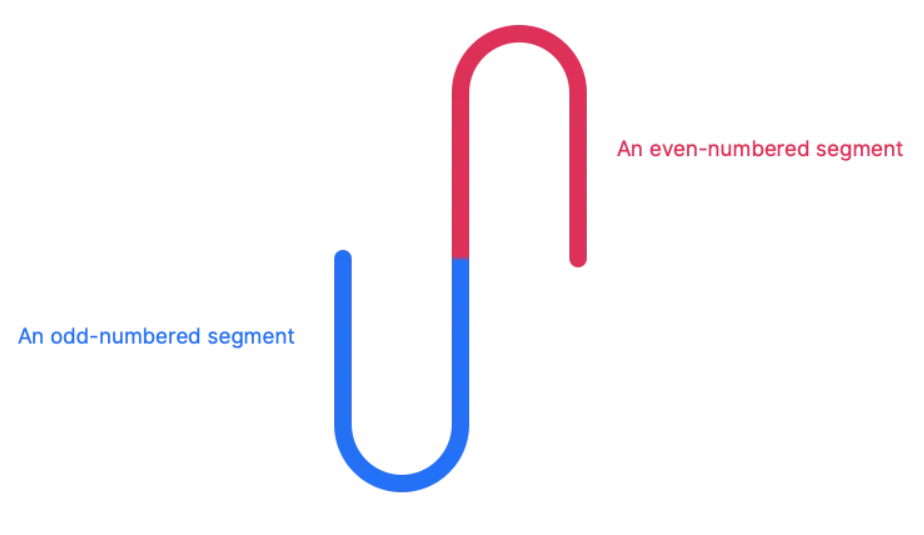

# Audio Spectrum

## A web page read a mp3
```js
// Set up audio context
window.AudioContext = window.AudioContext || window.webkitAudioContext;
const audioContext = new AudioContext();
let currentBuffer = null;
```

```js
const visualizeAudio = url => {
  fetch(url)
    .then(response => response.arrayBuffer())
    .then(arrayBuffer => audioContext.decodeAudioData(arrayBuffer))
    .then(audioBuffer => visualize(audioBuffer));
};
```
## Filtering the data
```js
// and we’ll be left with one channel’s worth of data.
audioBuffer.getChannelData(0);
```
initial sample code
```js
const filterData = audioBuffer => {
  const rawData = audioBuffer.getChannelData(0); // We only need to work with one channel of data
  const samples = 70; // Number of samples we want to have in our final data set
  const blockSize = Math.floor(rawData.length / samples); // Number of samples in each subdivision
  const filteredData = [];
  for (let i = 0; i < samples; i++) {
    // 0, blockSize , 2* blockSize,...间隔取样。一共取70份。
    filteredData.push(rawData[i * blockSize]); 
  }
  return filteredData;
}
```
find the average of the samples block range
```js
const filterData = audioBuffer => {
  const rawData = audioBuffer.getChannelData(0); // We only need to work with one channel of data
  const samples = 70; // Number of samples we want to have in our final data set
  const blockSize = Math.floor(rawData.length / samples); // the number of samples in each subdivision
  const filteredData = [];
  for (let i = 0; i < samples; i++) {
    let blockStart = blockSize * i; // the location of the first sample in the block
    let sum = 0;
    for (let j = 0; j < blockSize; j++) {
      sum = sum + Math.abs(rawData[blockStart + j]) // find the sum of all the samples in the block
    }
    filteredData.push(sum / blockSize); // divide the sum by the block size to get the average
  }
  return filteredData;
}
```
## normalize the data
```js
const normalizeData = filteredData => {
  const multiplier = Math.pow(Math.max(...filteredData), -1);
  return filteredData.map(n => n * multiplier);
}
```
这样确保将最大数据点设置为1，其余数据将按比例缩放。

## Visualizing the data
```js
const draw = normalizedData => {
  // Set up the canvas
  const canvas = document.querySelector("canvas");
  const dpr = window.devicePixelRatio || 1;
  const padding = 20;
  canvas.width = canvas.offsetWidth * dpr;
  canvas.height = (canvas.offsetHeight + padding * 2) * dpr;
  const ctx = canvas.getContext("2d");
  ctx.scale(dpr, dpr);
  ctx.translate(0, canvas.offsetHeight / 2 + padding); // Set Y = 0 to be in the middle of the canvas
};
```
by default, (0,0) is in the top-left of the box, but we can save ourselves a lot of math by setting (0, 0) to be in the middle of the left edge.


```js
const drawLineSegment = (ctx, x, y, width, isEven) => {
  ctx.lineWidth = 1; // how thick the line is
  ctx.strokeStyle = "#fff"; // what color our line is
  ctx.beginPath();
  y = isEven ? y : -y;
  ctx.moveTo(x, 0);
  ctx.lineTo(x, y);
  // x ,y coordinates,radius,start drawing,end drawing,A boolean value telling our turtle to draw either counterclockwise
  ctx.arc(x + width / 2, y, width / 2, Math.PI, 0, isEven);
  ctx.lineTo(x + width, 0);
  ctx.stroke();
};
```



back to the draw() function.
```js
const draw = normalizedData => {
  // Set up the canvas
  const canvas = document.querySelector("canvas");
  const dpr = window.devicePixelRatio || 1;
  const padding = 20;
  canvas.width = canvas.offsetWidth * dpr;
  canvas.height = (canvas.offsetHeight + padding * 2) * dpr;
  const ctx = canvas.getContext("2d");
  ctx.scale(dpr, dpr);
  ctx.translate(0, canvas.offsetHeight / 2 + padding); // Set Y = 0 to be in the middle of the canvas

  // draw the line segments
  const width = canvas.offsetWidth / normalizedData.length;
  for (let i = 0; i < normalizedData.length; i++) {
    const x = width * i;
    let height = normalizedData[i] * canvas.offsetHeight - padding;
    if (height < 0) {
        height = 0;
    } else if (height > canvas.offsetHeight / 2) {
        // height = height > canvas.offsetHeight / 2;// TYPO?
        height = canvas.offsetHeight / 2;
    }

    // (i + 1) % 2 is neat trick
    drawLineSegment(ctx, x, height, width, (i + 1) % 2);
  }
};
```

## reference
- https://css-tricks.com/making-an-audio-waveform-visualizer-with-vanilla-javascript/
